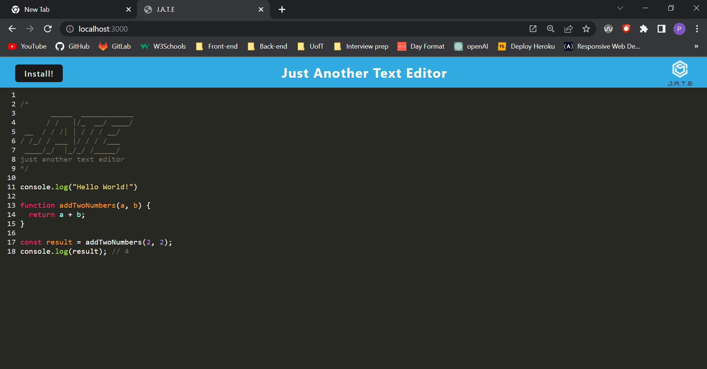
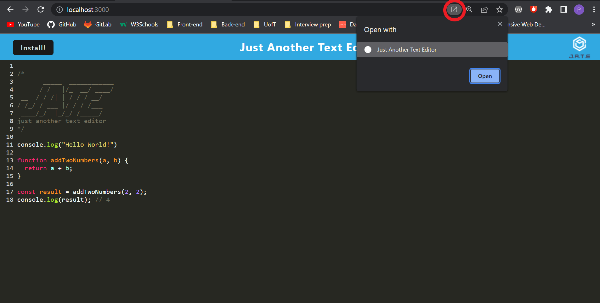
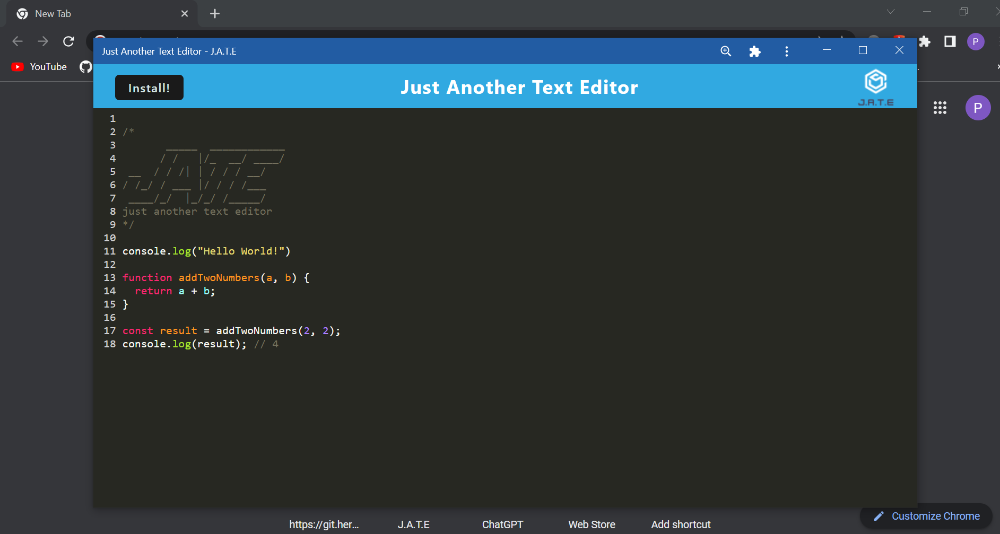

# Text Editor

## Description

A note editor with JavaScript syntax highlighting

## Table of Contents

- [Installation](#installation)
- [Usage](#usage)
- [License](#license)
- [How to Contribute](#how-to-contribute)
- [Tests](#tests)
- [Questions](#questions)

## Installation

In order to use this application, you will want to clone this repository and its dependencies. To do this, after cloning the reposiroty you can run the commands npm install followed by npm run start:dev in the terminal

## Usage

The following images will take you through the steps on how to use this application

This is what it looks like when opened on a browser

There is an option to open the application on its own window if you click on the icon on the right side of the url

Lastly once opened that way, it will look more like a native application

## License

The license used in this project is: MIT License

## How to Contribute

There are no current ways to contribute to this repository

## Tests

I have put this application through rigorous testing in order to make sure it works properly

## Questions

Github profile: https://github.com/PacoCasillas

Please email any questions to: -